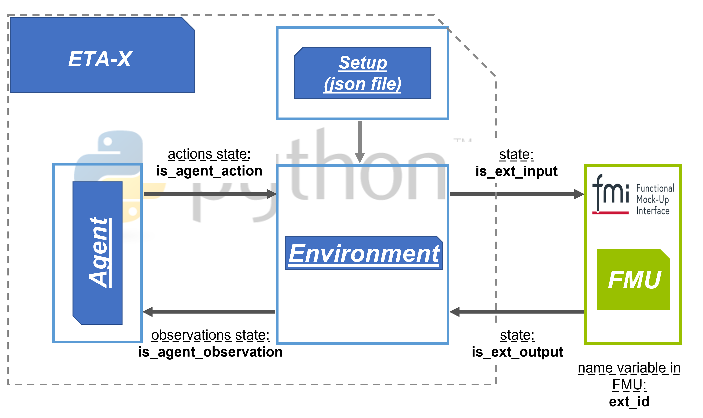

.. _intro-eta-ctrl:

Introduction
=============
*ETA Ctrl* is the rolling horizon optimization module which combines the functionality of the
other modules. It is based on the Farama *gymnasium* framework and utilizes algorithms and functions
from the `stable_baselines3 <https://stable-baselines3.readthedocs.io/>`_ package. The *ETA Ctrl* module
also contains some extensions for *stable_baselines3*, these include additional policies, extractors,
schedules and agents.

The main components and their relationships are illustrated as follows:

.. mermaid:: /guide/figures/class_diagram.mmd
   :name: class-diagram
   :caption: `EtaCtrl` acts as an orchestrator for the Gymnasium based Agent-Environment loop.

The module contains functions meant to simplify the general process of creating rolling horizon
optimization models. It contains the *EtaCtrl* class which in turn combines all of this information
such that you can start simple optimizations in just two lines. For example, to start the pendulum
example (which is taken from the *gymnasium* framework):

.. literalinclude:: /../examples/pendulum/main.py
    :start-after: --main--
    :end-before: --main--
    :dedent:

The resulting optimization will have full configuration support, logging, support for multiple
series of optimization runs and many other things.

.. note::
    It is not necessary to use the *EtaCtrl* class to utilize the other tools provided by this module. For example,
    you can utilize the functionality provided by :ref:`eta_experiment_config` and :ref:`eta_ctrl_common` to build
    completely custom optimization scripts while still benefitting from centralized configuration, management of file
    paths, additional logging features and so on.

The algorithms in *ETA Ctrl* are an extension to the algorithms provided by *stable_baselines3*.
These algorithms specifically include some algorithms which are not from the field of reinforcement
learning but can be employed in generalized rolling horizon optimization settings.

The functions available in eta_ctrl.envs make it easy to create new, custom environments
(see `stable_baselines3 custom environments <https://stable-baselines3.readthedocs.io/en/master/guide/custom_env.html>`_).
For example, they provide functionality for integrating FMU simulation models,
communicating with real assets in factories, or integrating Pyomo models as environments.

The *EtaCtrl* class is built on top of this functionality and orchestrates the interaction between
the agent, the environment, and any optional external models. For a detailed description of the
control loop, time indexing, scenario data availability, and timing assumptions, see
:ref:`time-management`.

Take a look at the examples folder in the *ETA Ctrl* repository to see some of the possibilities.

What are series and runs?
---------------------------
*ETA Ctrl* builds on the concept of experiments. An experiment can be configured to perform
optimizations using specific environments and agents. An example of this concept is shown in the figure

    Example of the ETA Ctrl experiment concept.

As shown in the figure, the process starts with the configuration (setup) file, which is written in
JSON format (see :ref:`eta_experiment_config`). Based on this configuration, the environment and
corresponding agent can be initialized and executed.

An experiment with a single configuration can consist of a series of different optimization runs.
Each optimization run could for example have different external conditions for the environment
(such as being performed at a different time of the year).

What is an algorithm or agent?
-----------------------------------
The control algorithm receives inputs from the environment and follows a strategy to control
a system. This strategy could be either rule based, determined by mathematical optimization,
machine learning (reinforcement learning) or other methods, such as metaheuristics.

The agent receives observations from an environment and determines actions to control the environment
based on those observations.

What is an environment?
--------------------------
The environment is a dynamic system, which receives inputs (actions) from the control algorithm.
Observations made in the environment are passed to the agent.

How to get started
--------------------
Usually you want to use the *EtaCtrl* class as shown above to initialize your experiment.
This will automatically load a JSON configuration file (see also :ref: `eta_experiment_config`).
The file to load the configuration from is specified during class instantiation:

.. autoclass:: eta_ctrl::EtaCtrl

After the class is instantiated, you can use the play and learn methods to execute the experiment:

.. autofunction:: eta_ctrl::EtaCtrl.learn

.. autofunction:: eta_ctrl::EtaCtrl.play

.. _eta_experiment_config:

Experiment configuration
-------------------------
The central part of the ETA Ctrl module is the experiment configuration. This configuration can be
read from a JSON, TOML, or YAML file and determines the setup of the entire experiment, including
which agent and environment to load and how to set each one up. The configuration is defined by the
*Config* class and its subsidiaries *ConfigPaths*, *ConfigSetup*, and *ConfigSettings*.

A *Config* object is frozen (immutable), created once when an experiment starts and unchanged for
its entire duration. Based on the same configuration, a *RunInfo* object is created for every
optimization run performed via the :meth:`~eta_ctrl.EtaCtrl.learn` and :meth:`~eta_ctrl.EtaCtrl.play`
methods. *RunInfo* adds the identity of the specific run (series and run name) and resolves the
relative paths configured in *ConfigPaths* to absolute paths for that run. This relationship is
illustrated below:

.. mermaid:: /guide/figures/config_class_diagram.mmd
   :name: config-class-diagram
   :caption: One frozen `Config` describes the experiment, while a new `RunInfo` is created for every optimization run.

When you are using EtaCtrl (the class) the configuration will be read automatically.
If not, use :func:`eta_ctrl.config::from_file` to read the configuration directly:

.. autofunction:: eta_ctrl.config::Config.from_file

Configuration example
^^^^^^^^^^^^^^^^^^^^^^^^
The following is the configuration for the pendulum example in this repository. It is relatively
minimal in that it makes extensive use of the defaults defined in the *Config* classes.

.. literalinclude:: /../examples/pendulum/config_learning.json
    :language: json

Config section 'setup'
^^^^^^^^^^^^^^^^^^^^^^^^
The settings configured in the setup section are the following:

.. autopydantic_model:: eta_ctrl.config.config_setup::ConfigSetup
    :no-index:

Config section 'paths'
^^^^^^^^^^^^^^^^^^^^^^^
The optional paths section defines the relative paths and file names used to lay out the files of an
optimization run, such as the results folders, names of model checkpoints, and log files. All
paths are resolved relative to the config root path; see the *RunInfo* section below for how they are
used.

.. autopydantic_model:: eta_ctrl.config.config_paths::ConfigPaths
    :no-index:

Config section 'settings'
^^^^^^^^^^^^^^^^^^^^^^^^^^
The configuration options in the settings section are the following.

 .. note::
    The configuration options "environment" and "agent" are separate sections.
    They are loaded into the settings object as dictionaries.
    To determine, which options are valid for these sections, please look at the arguments required
    for instantiation of the agent or environment. These arguments must be specified as parameters in
    the corresponding section.

.. autopydantic_model:: eta_ctrl.config.config_settings::ConfigSettings
    :no-index:

Configuration for optimization runs
^^^^^^^^^^^^^^^^^^^^^^^^^^^^^^^^^^^^^^^^
While the *Config* object describes the experiment itself, every individual optimization run (for
example a single training run or a single evaluation) needs its own identity and file paths. This
is captured by the *RunInfo* class, which combines the series and run names of the current run with
the *Config* that EtaCtrl holds, using the paths defined in *ConfigPaths* (see the paths section
above) to determine where models, log files, and other run outputs are stored. It can also store
information about the environments of the run.

Below, the derived attributes of RunInfo that are available at runtime are listed. Full documentation is in the API
docs: :py:class:`eta_ctrl.config.RunInfo`.

.. note::
    You do not need to set any of the parameters listed here yourself.

.. autoclass:: eta_ctrl.config::RunInfo
    :members:
    :no-index:

    :exclude-members: model_config, set_env_info, create_results_folders
