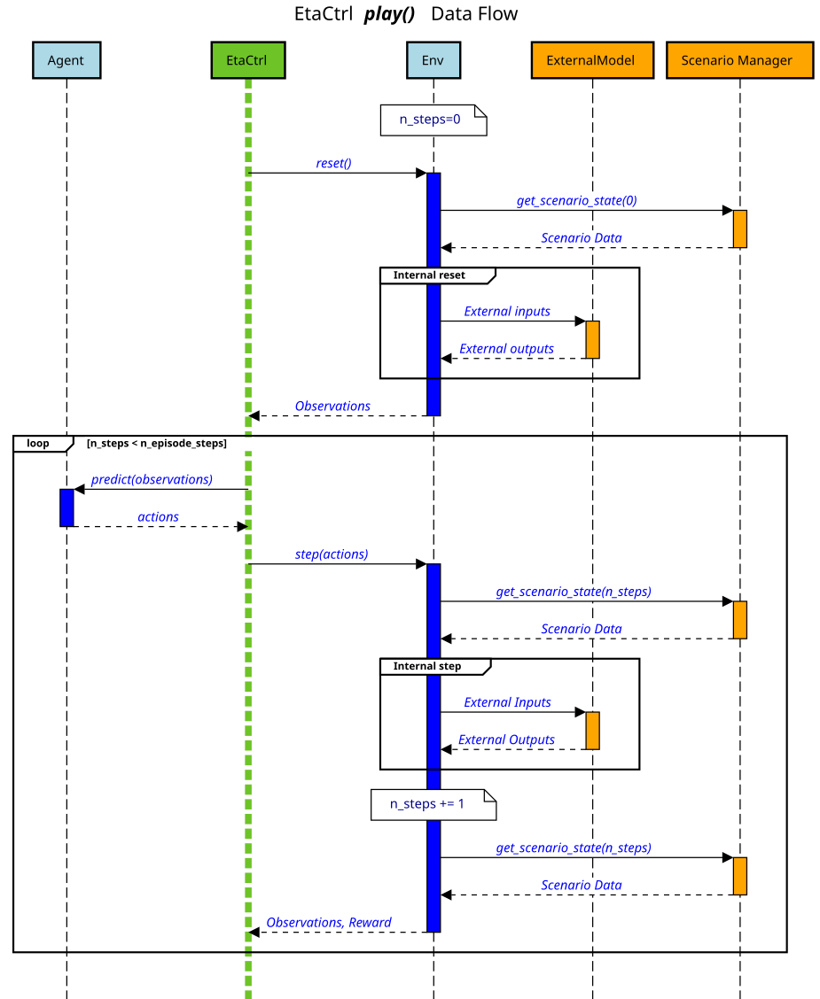

.. _time-management:

Time Management and Control Flow
==================================

*EtaCtrl* acts as the central coordinator that drives the interaction between the agent, the
environment, and any optional components such as external models. It controls when the environment
performs a step, when the agent receives observations, and when actions are applied. Understanding this
control flow is important when integrating custom environments or interpreting logged data.

Control Loop
-------------

The sequence diagram below shows the full data flow for a ``play()`` call (the same structure
applies during ``learn()``). The participants are:

- **EtaCtrl** — the outer controller that manages the episode loop.
- **Agent** — the control algorithm that maps observations to actions.
- **Env** — the environment under control.
- **ExternalModel** — an optional model called from inside the environment step (e.g. an FMU
  simulator or Pyomo model).
- **Scenario Manager** — provides pre-loaded time-series data to the environment.

    Sequence diagram of the EtaCtrl control loop during ``play()``.

The episode starts with ``reset()``. The environment loads scenario data at index ``t=0``,
performs any internal initialisation, and returns the initial observations to *EtaCtrl*.
No time has elapsed at this point, the reset corresponds to the state *before* the first
sampling period begins.

The loop then runs until ``n_steps`` reaches ``n_episode_steps``. In each iteration:

1. *EtaCtrl* calls ``agent.predict(observations)`` to obtain actions for the current timestep.
2. *EtaCtrl* calls ``env.step(actions)``.
3. Inside the step, the environment first loads scenario data at index ``t = n_steps``, then calls specific environment code in ``BaseEnv._step``
4. The environment increments ``n_steps``, loads scenario data at the next timestep and returns the new observations and the reward.

Therefore, the observations returned after the *k*-th step carry scenario data at index
``t = k + 1``, and actions computed from those observations also target timestep ``t = k + 1``.
The last step sets ``n_steps = n_episode_steps``, so the last scenario data index used is
``t = n_episode_steps``.

Scenario Data and Time Indexing
---------------------------------

The following diagram illustrates the time indexing concretely using a tank heating example.
The temperature trace shows how the state evolves; the indexed markers on the top and bottom
show at which time index observations are reported and actions take effect.

.. plot:: pyplots/kea_data_flow.py

The key points to take away from the diagram:

- **Reset does not advance time.** The reset returns the observation at ``t=0`` without
  consuming a sampling period.
- **Each step advances time by exactly one sampling period.** The step from ``t=k`` to
  ``t=k+1`` is where physical time passes.
- **The last observation index is** ``t = n_episode_steps``. Scenario data must therefore
  cover at least ``n_episode_steps + 1`` data points (indices 0 through ``n_episode_steps``).

Timing Assumptions
-------------------

The *EtaCtrl* framework inherits the synchronous, single-agent execution model of *gymnasium*
and *stable_baselines3*: time advances in fixed steps and the next step cannot begin before the
current one returns. This implies the following assumption:

.. note::
    The computation time of the agent must be significantly shorter than the sampling time
    of the environment. If this is not the case the framework's notion of discrete, synchronous
    timesteps breaks down and results will no longer correspond to real-time behaviour.

In practice this is satisfied whenever reinforcement learning inference or rule-based control
runs in software (microseconds to milliseconds) and the physical process is sampled at intervals
of seconds or more.

Actuation Delay
^^^^^^^^^^^^^^^^

If the application requires modelling a delay between when an action is decided and when it
takes effect — either to represent a physical actuator latency or a deliberate hold-over logic —
this can be implemented as an environment wrapper without modifying the core environment:

.. code-block:: python

    import gymnasium as gym
    import numpy as np

    class ActuationDelayWrapper(gym.Wrapper):
        """Delays actions by *delay* timesteps."""

        def __init__(self, env: gym.Env, delay: int = 1) -> None:
            super().__init__(env)
            self._delay = delay
            self._action_buffer: list = []

        def reset(self, **kwargs):
            self._action_buffer.clear()
            return self.env.reset(**kwargs)

        def step(self, action):
            self._action_buffer.append(action)
            if len(self._action_buffer) <= self._delay:
                delayed_action = np.zeros_like(action)
            else:
                delayed_action = self._action_buffer[-1 - self._delay]
            return self.env.step(delayed_action)

This approach requires that the agent is still fast enough relative to the sampling time — the
wrapper only shifts *which* action is applied, it does not compensate for slow agents.
