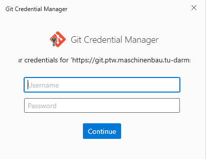
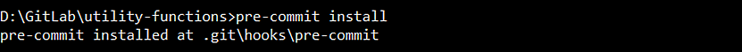

.. _development:

Installation and Guide for Developers
=================================================================================

This section describes how to install *ETA Ctrl* using *poetry*, and how to contribute to development.

Contributing to development
-----------------------------

If you would like to contribute, please create an issue in the repository to discuss your suggestions.
Once the general idea has been agreed upon, you can create a merge request from the issue and
implement your changes there.

If you are planning to develop on this package, based on the requirements of another
package, you might want to import directly from a local git repository. To do this,
uninstall ETA Ctrl from the other projects virtual environment and add the path to the local
*ETA Ctrl* repository to the other projects main file:

.. code-block::

    sys.path.append("<path to local ETA Ctrl repository>")

.. _install_poetry:

Installing Poetry
--------------------
This project is being managed by `Poetry  <https://python-poetry.org/docs/#installation>`_.
It's a tool for Python dependency management and packaging.
In order to install the development environment, you need to install Poetry first.

Open a terminal for the next steps (such as PowerShell)

 .. note::
    Depending on where the relevant folders for the installation are located on your OS,
    the terminal may need to be executed as administrator / root.

It's recommended to install Poetry with pipx. This will install Poetry in an isolated environment.
If you don't have pipx installed, you can install it with pip:

.. code-block:: console

    $ python -m pip install pipx
    $ python -m pipx ensurepath

Then install Poetry with pipx:

.. code-block:: console

    $ pipx install poetry==2.3.2

.. note::
    Poetry will initially use the Python version that it has been installed with.
    To change the Python version, see :ref:`managinv_environments_poetry`.

By default, Poetry will create its own virtual environment for each project.
Only if there is already a virtual environment called ".venv" in the project folder, Poetry will use it.
The virtual environments will be installed in:

.. code-block:: none

    C:\Users\<username>\AppData\Local\pypoetry\Cache\virtualenvs\

For more information, see the `Poetry documentation <https://python-poetry.org/docs/#installing-with-pipx>`_.

Installation of ETA Ctrl
-------------------------------------
First, clone the repository to a directory of your choosing. You can use a git GUI for this or
execute the following command. See also :ref:`install_git`.

.. code-block:: console

    $ git clone https://git.ptw.maschinenbau.tu-darmstadt.de/eta-fabrik/public/eta-ctrl

You might be asked for your git login credentials.

    Git login window.

After this, navigate to the root directory **eta-ctrl**

.. code-block:: console

   $ cd eta-ctrl

\.. and install the project via poetry with the
extra *develop* . This includes all requirements plus everything required for development
and continuous integration checks:

.. code-block:: console

   $ poetry install

.. note::
    Updating the project dependencies is done with the same command.

We use pre-commit to check code before committing. Therefore, after the installation completes,
please install pre-commit before performing the first commits to the repository.
This ensures that your commits will be checked and formatted automatically.

.. code-block:: console

    $ poetry run pre-commit install

    Confirmation of correct pre-commit installation.

.. note::

    When using pre-commit for the first time, it will take longer as it will install all the hooks.

| When using an IDE or code editor, make sure that it uses the virtual environment managed by Poetry.
| For PyCharm, see: https://www.jetbrains.com/help/pycharm/poetry.html#poetry-env
| For VS Code, see: https://code.visualstudio.com/docs/python/environments

.. _managinv_environments_poetry:

Managing Environments with Poetry
-----------------------------------

You can run commands in the virtual environment by using the following command:

.. code-block:: console

    $ poetry run <command>

To check which Python version Poetry is using and get the path of that environment,
execute the following command:

.. code-block:: console

    $ poetry env info

You can change the Python version Poetry uses with:

.. code-block:: console

    $ poetry env use <full python path>

To list all available Python versions on Windows, run:

.. code-block:: console

    $ py -0p

For more information, see the `Poetry docs <https://python-poetry.org/docs/managing-environments>`_.

.. _testing_your_code:

Testing your code
-------------------------------
Please always execute the tests before committing changes. You can do this by navigating to the main
folder of the *ETA Ctrl* repository and executing the following command in a terminal.

.. code-block:: console

    $ poetry run pytest

Or if you have the virtual environment already activated:

.. code-block:: console

    $ pytest

Editing this documentation
-----------------------------

Sphinx is used as a documentation-generator. The relevant files are located in the *docs*
folder of the repository. If you correctly installed *ETA Ctrl* with the develop
extension, sphinx should already be installed.

You can edit the *.rst-files* in the *docs* folder. A simple text editor is sufficient for this.
A helpful start for learning the syntax can be found `here <https://www.sphinx-doc.org/en/master/usage/restructuredtext/basics.html>`_.

For test purposes, navigate to the *docs* folder and execute the following command:

.. code-block:: console

    $ poetry run make html

This creates a folder named *_build* (inside the *docs* folder) which allows the HTML pages to
be previewed locally. This folder will not be committed to git. Re-execute this command each
time you edit the documentation to see the changes (you may have to refresh the HTML page).

.. tip::

    Instead of manually refreshing, you can use the `Live Server
    <https://marketplace.visualstudio.com/items?itemName=ritwickdey.LiveServer>`_ extension
    for VS Code (``ritwickdey.liveserver``). Open ``docs/_build/html/index.html`` and click
    **Go Live** in the status bar. The browser tab will reload automatically each time you
    rebuild the documentation.

If you have problems using sphinx see :ref:`sphinx_not_found`.

GitLab - CI/CD
--------------------------------------

Your contribution via pull request can only be merged if the steps from the CI/CD are approved.
The stages are:

- *image-build*: build dependency images used by CI jobs
- *setup*: verify project metadata and prepare dependency cache artifacts
- *check*: verify the check-style
- *test*: check all tests
- *deploy*: verify correct documentation deploy

All the CI/CD instructions are listed in the *.gitlab-ci.yml* file.

GitLab - Docker containers
-----------------------------

The directory *.gitlab/docker* contains the Dockerfile used to build the dependency
images for the CI/CD pipeline. These images are stored in **Packages & Registries >
Container Registry** and are used by the GitLab jobs defined in *.gitlab-ci.yml*.

The CI dependency images are tagged by Poetry and Python version, for example::

    git-reg.ptw.maschinenbau.tu-darmstadt.de/eta-fabrik/public/eta-ctrl/poetry2.3.2:py3.11
    git-reg.ptw.maschinenbau.tu-darmstadt.de/eta-fabrik/public/eta-ctrl/poetry2.3.2:py3.12

The images are normally built automatically by the GitLab CI job ``build-docker-images``.
This job runs in the ``image-build`` stage and uses Kaniko to build and push the
images without requiring Docker-in-Docker.

The job runs automatically on the default branch when one of the dependency image
inputs changes:

- ``poetry.lock``
- ``pyproject.toml``
- ``.gitlab/docker/dockerfile``
- ``.gitlab-ci.yml``

Each supported Python version is built in a separate matrix job, so every Kaniko
build runs in an isolated job container.

If an image needs to be rebuilt manually, start the manual ``build-docker-images``
jobs from the GitLab pipeline UI. This is the preferred fallback for normal
maintenance.

Manual local builds are still possible for debugging. First log in to the GitLab
container registry:

.. code-block:: console

    $ docker login git-reg.ptw.maschinenbau.tu-darmstadt.de

Then build an image locally, for example for Python 3.12:

.. code-block:: console

    $ docker build \
        -t git-reg.ptw.maschinenbau.tu-darmstadt.de/eta-fabrik/public/eta-ctrl/poetry2.3.2:py3.12 \
        -f .gitlab/docker/dockerfile \
        --build-arg="PYTHON_VERSION=3.12" \
        --build-arg="POETRY_VERSION=2.3.2" \
        .

Push the image only if you intentionally want to update the shared registry tag:

.. code-block:: console

    $ docker push git-reg.ptw.maschinenbau.tu-darmstadt.de/eta-fabrik/public/eta-ctrl/poetry2.3.2:py3.12
